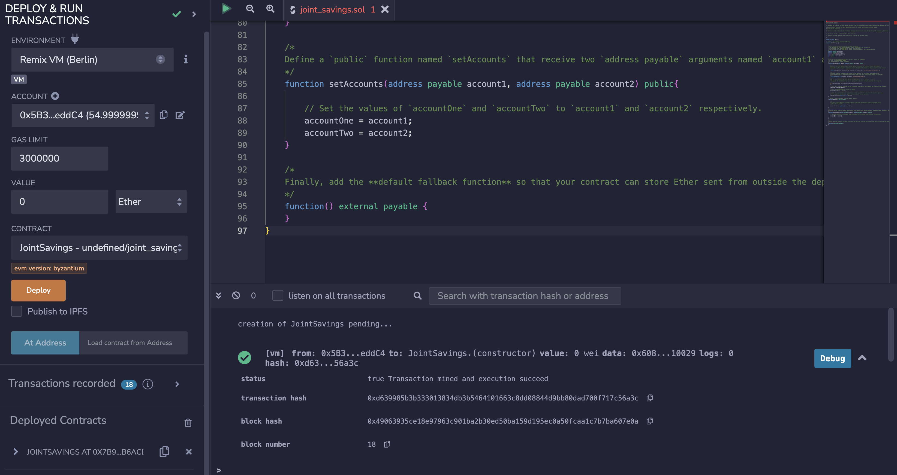
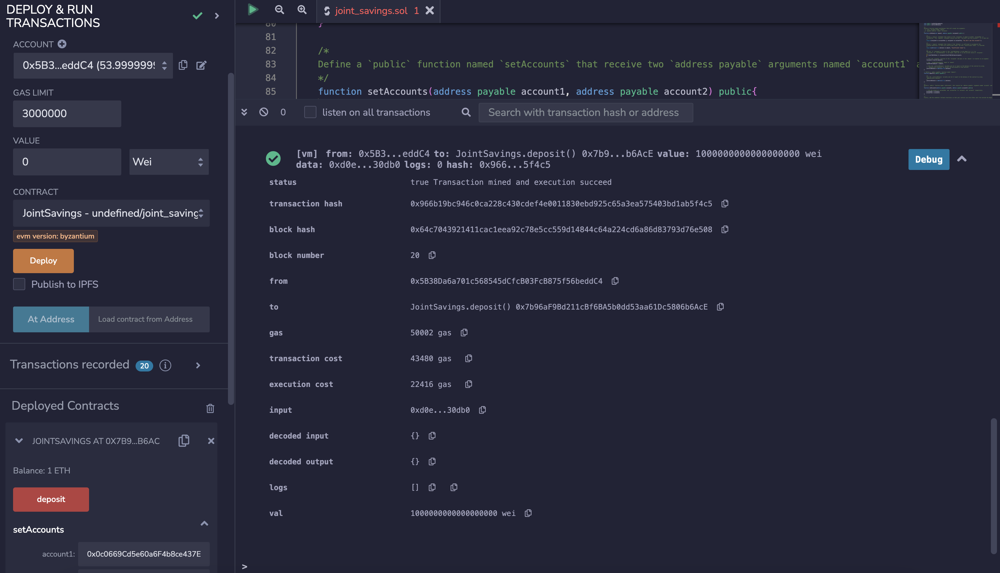
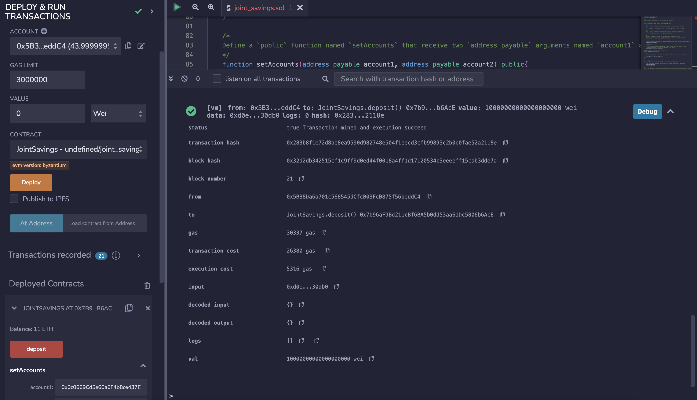
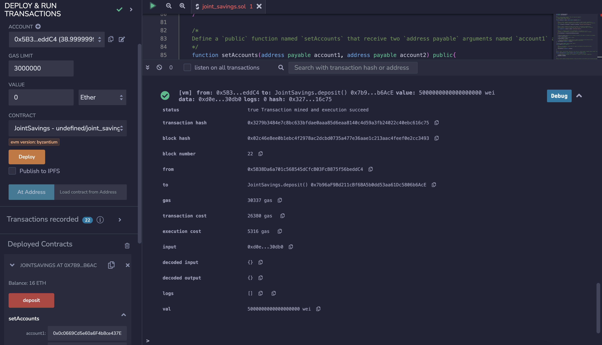
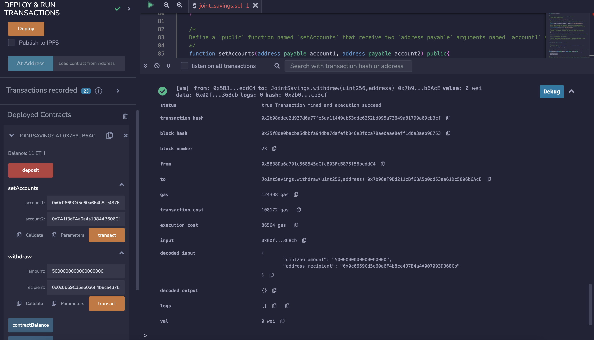
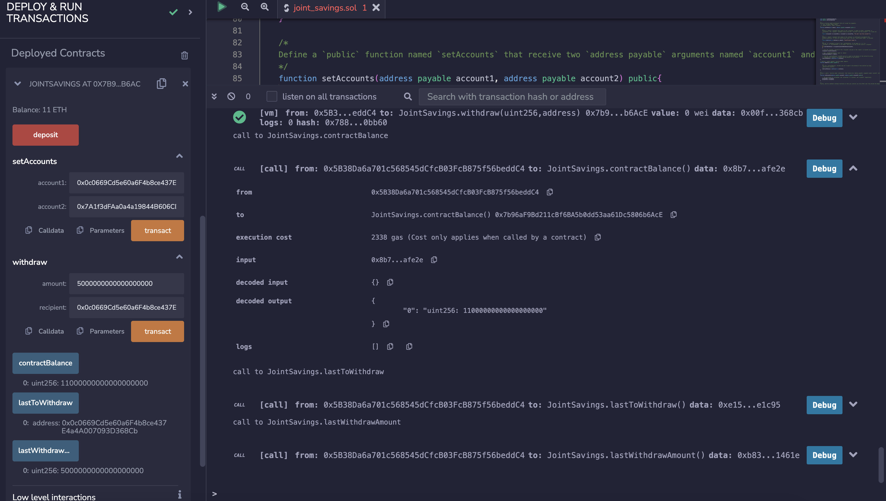
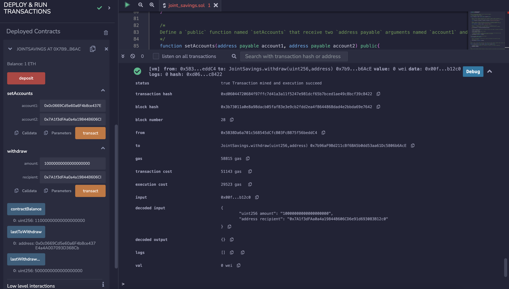
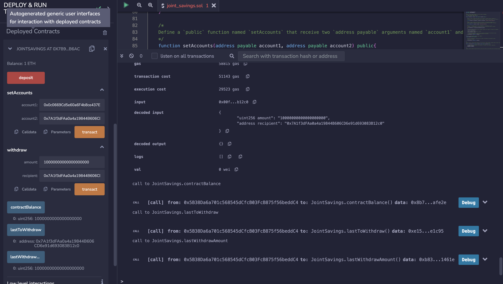

# Unit 20 - "Joint Savings Account"


### Background

1. Create a Joint Savings Account Contract in Solidity

2. Compile and Deploy Contract in the JavaScript VM

3. Interact with  Deployed Smart Contract

#### Creating a Joint Savings Account Contract in Solidity

1. Define a new contract named `JointSavings`.

2. Define the following variables in the new contract:

    * Two variables of type `address payable` named `accountOne` and `accountTwo`

    * A variable of type `address public` named `lastToWithdraw`

    * Two variables of type `uint public` named `lastWithdrawAmount` and `contractBalance`


3. Define a function named `withdraw` that accepts two arguments: `amount` of type `uint` and `recipient` of type `payable address`. In this function, code the following:

    * Define a `require` statement that checks if `recipient` is equal to either `accountOne` or `accountTwo`. If it isn’t, the `require` statement returns the “You don't own this account!” text.

    * Define a `require` statement that checks if `balance` is sufficient for accomplishing the withdrawal operation. If there are insufficient funds, it returns the “Insufficient funds!” text.

    * Add an `if` statement to check if `lastToWithdraw` is not equal (`!=`) to `recipient`. If it’s not equal, set it to the current value of `recipient`.

    * Call the `transfer` function of the `recipient`, and pass it the `amount` to transfer as an argument.

    * Set `lastWithdrawAmount` equal to `amount`.

    * Set the `contractBalance` variable equal to the balance of the contract by using `address(this).balance` to reflect the new balance of the contract.


4. Define a `public payable` function named `deposit`. In this function, code the following:

    * Set the `contractBalance` variable equal to the balance of the contract by using `address(this).balance`.

5. Define a `public` function named `setAccounts` that takes two `address payable` arguments, named `account1` and `account2`. In the body of the function, set the values of `accountOne` and `accountTwo` to `account1` and `account2`, respectively.

6. Add a fallback function.

#### Deploy

1. Compile your smart contract. If an error occurs, review your code, and make the necessary changes for a successful compilation.

2. In the Remix IDE, navigate to the “Deploy & Run Transactions” pane, and then make sure that “JavaScript VM” is selected as the environment.

3. Click the Deploy button to deploy your smart contract, and then confirm that it successfully deployed.

#### Interact

1. Use the `setAccounts` function to define the authorized Ethereum address that will be able to withdraw funds from your contract.

    >
    > ```text
    > Dummy account1 address: 0x0c0669Cd5e60a6F4b8ce437E4a4A007093D368Cb
    > Dummy account2 address: 0x7A1f3dFAa0a4a19844B606CD6e91d693083B12c0
    > ```




2. Test the deposit functionality of your smart contract by sending the following amounts of ether. After each transaction, use the `contractBalance` function to verify that the funds were added to your contract:

    * Transaction 1: Send 1 ether as wei.
        
    * Transaction 2: Send 10 ether as wei.
        
    * Transaction 3: Send 5 ether.
        

3. Once you’ve successfully deposited funds into your contract, test the contract’s withdrawal functionality by withdrawing 5 ether into `accountOne` and 10 ether into `accountTwo`. After each transaction, use the `contractBalance` function to verify that the funds were withdrawn from your contract. Also, use the `lastToWithdraw` and `lastWithdrawAmount` functions to verify that the address and amount were correct.




